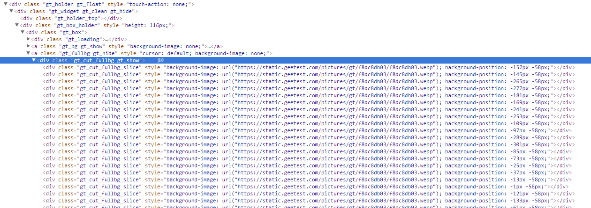
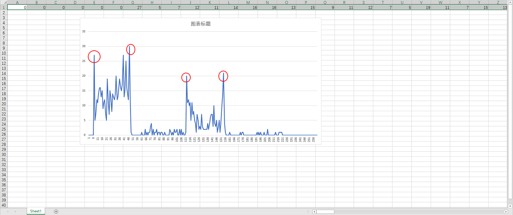

<!--
.. title: 破解geetest验证码
.. slug: po-jie-geetestyan-zheng-ma
.. date: 2018-04-23 19:42:46 UTC+08:00
.. tags: Python, Selenium, 验证码, 破解
.. category: 
.. link: 
.. description: 
.. type: text
-->

本文所述内容仅用于实验学习之用，任何因非法商业用途造成的法律纠纷作者概不负责

-------

# 破解geetest验证码

写过爬虫的基本都碰到过验证码问题，滑动验证码是其中一类略微高级的验证码类型。国内的滑动验证码基本由geetest提供，本文主要叙述如何绕过（破解）geetest滑动验证码

## 1. 依赖

* python 3.6
* selenium，模拟浏览器请求/渲染
* lxml，html页面处理
* pillow，python图像库
* numpy+peakutils，数学运算

## 2. 过程

以国内某著名二次元网站为例(不是我说的啊！)，登陆界面如图所示，点击验证码的滑块就会弹出验证码，你需要将滑块滑到对应的空缺位置上即可验证成功


### 2.1 dom解析

主要dom如图所示



你所看到的图不是原图，原图经过切片乱序之后由css拼成的，如图所示


### 2.2 还原原图

观察可得，乱序图有`(parts_per_line=26)*2=52`块切片，每块切片的宽度`part_width`和高度可以自行计算得`part_height`，查阅css手册得`background-position`的坐标系第一象限在右下角。

对第`idx`个切片来说，它在乱序图中的位置为`background-position`取负

它在原图中的位置`dest_x=(idx % parts_per_line) * part_width`，`dest_y=(idx // parts_per_line) * part_height`。

有了计算公式，可以用pillow的方法切割和拼接图片

```python
# 切割
image.crop((x, y, x+w, y+h))
# 拼接
image.paste(target_image, (dest_x, dest_y))
```

### 2.3 获取待验证图片

鼠标悬停在滑块上并不会显示待验证位置在哪，需要点击之后才会显示，需要让selenium执行鼠标点击并且不放这个动作

```python
# 获得滑块对象
drag = driver.find_element_by_css_selector('.gt_slider_knob.gt_show')
# 执行点击并且不放的动作
action = ActionChains(driver)
action.click_and_hold(drag).perform()
```

这个时候浏览器中应该是这个样子


之后截取待验证的图片

```python
# selenium截图
image_to_verify = Image.open(io.BytesIO(driver.get_screenshot_as_png()))
# 调用浏览器，执行js后返回框内图片相对于窗口的坐标
x = driver.execute_script('return $("div.gt_cut_fullbg")[0].getBoundingClientRect().left')
y = driver.execute_script('return $("div.gt_cut_fullbg")[0].getBoundingClientRect().top')
# 切割（同上）
image.crop(...)
```

### 2.4 获取拼图块大小

拼图块的dom

```html
<div class="gt_slice gt_show" style="left: 0px; background-image: url(&quot;https://static.geetest.com/pictures/gt/375495539/slice/1d4a39f5d.png&quot;); width: 53px; height: 52px; top: 47px;"></div>
```

大小都写在style上了，`slice_width=53, slice_height=52`

### 2.5 图像处理

这块是破解的核心逻辑，主要思路就是尽可能过滤掉图像中相同的像素，留下的就是不同的，我们主要是去找由两块拼图块垂直方向上的边缘。

我的做法是用自带滤波函数找到图像中的边缘，然后转灰度图，设置恰当阈值，做二值化

```python
image.filter(ImageFilter.FIND_EDGES).convert('L').point(lambda x: 0 if x < 120 else 255)
```

这里二值化的分界阈值是120，你可以试试别的，看看最终效果。

从右往左，扫描垂直方向上，两幅图里的像素差异，并记录差异像素个数

```python
x_diff = [0] * origin_image.width
    for i in range(origin_image.width - 1, -1, -1):
        diff_count = 0
        for j in range(origin_image.height - 1, -1, -1):
            if origin_image_grey.getpixel((i, j)) != image_to_verify_grey.getpixel((i, j)):
                diff_count += 1
        x_diff[i] = diff_count
```

将这个`x_diff`用excel绘制成折线图后，能很明显发现四个波峰



接下去要做的是从这个一维数组中提取四个波峰，这里用到了`peakutils`

```python
import numpy as np
from peakutils.peak import indexes
waves = indexes(np.array(x_diff), thres=7.0/max(x_diff), min_dist=20)
```

* thres，振幅阈值，振幅超过这个值才会被认为是波峰(不是很理解这个参数，求大佬解答)
* min_dist，波峰之间的最小间隔，理论上要接近拼图块宽度才比较合适，但是我试了效果并不好，不知道为什么

### 2.6 移动滑块

计算要移动的距离`offset=waves[2] - waves[0]`，并移动滑块

```python
action = ActionChains(driver)
action.drag_and_drop_by_offset(drag, offset, 0).perform()
```

### 2.7 完成

效果如图


## 附

源码：[https://github.com/hbprotoss/geetest-crack](https://github.com/hbprotoss/geetest-crack)